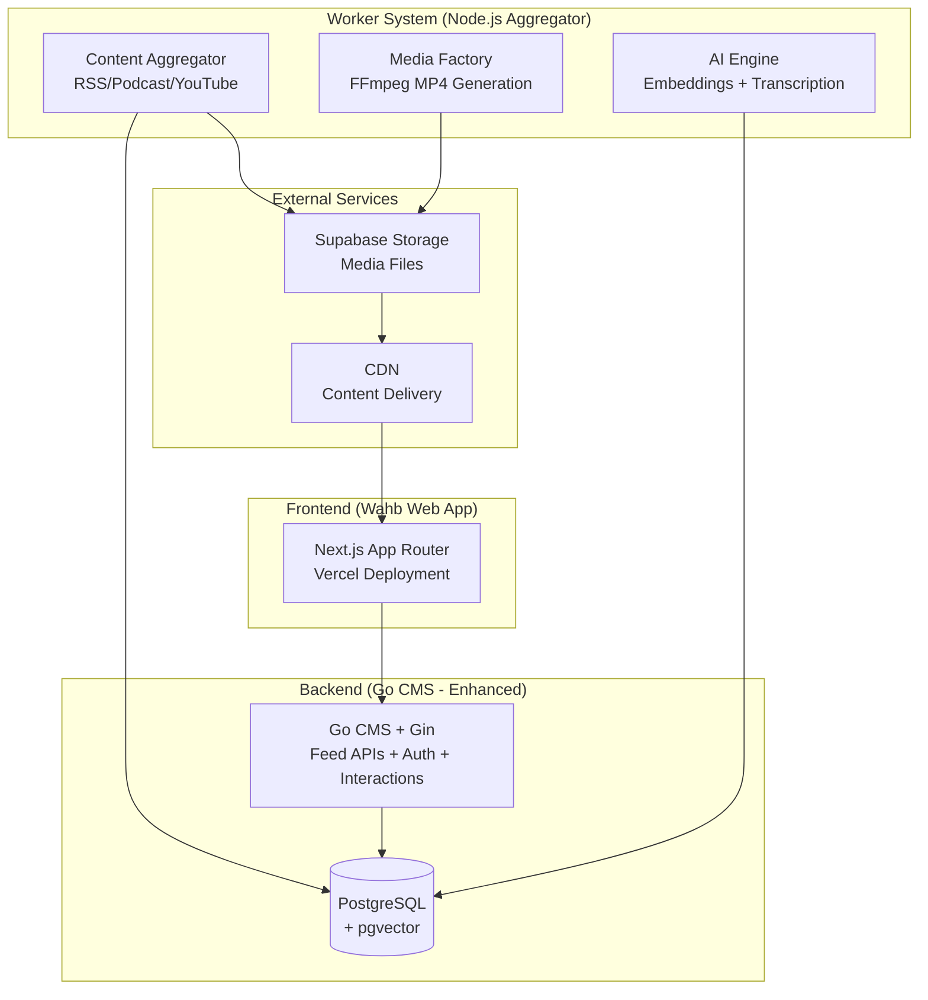
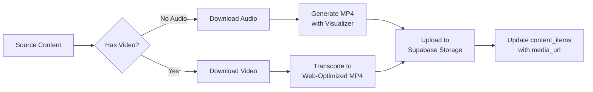

# Wahb Platform - Phased Implementation Plan

**Version:** 1.0  
**Created:** January 18, 2026  
**Platform:** Wahb - Social Media Platform (Audio-First + Magazine-Style News)

---

## Executive Summary

This plan outlines the phased development of **Wahb**, a mobile-first social platform featuring dual-mode discovery:
- **"For You" Feed**: TikTok-style vertical scrolling for audio/video content (podcasts, clips)
- **"News" Feed**: Magazine-style slides with 1 Featured + 3 Related items

### System Architecture Overview



---

## Phase Overview

| Phase | Name | Duration | Focus |
|-------|------|----------|-------|
| **Phase 1** | Foundation | 4-6 weeks | Project setup, CMS enhancements, core frontend |
| **Phase 2** | Content Pipeline | 4-6 weeks | Aggregator service, media processing, embeddings |
| **Phase 3** | Feed Intelligence | 3-4 weeks | Vector search, ranking, slide assembly |
| **Phase 4** | User Experience | 3-4 weeks | Interactions, bookmarks, polish |
| **Phase 5** | Scale & Optimize | 2-3 weeks | Caching, CDN, performance |
| **Phase 6** | Personalization Ready | 2-3 weeks | User interest vectors, future integration hooks |

---

## Phase 1: Foundation (4-6 weeks)

### 1.1 Project Setup & Infrastructure

#### [NEW] Wahb Web App (Next.js)
> **Location:** `c:\Users\saleh\Desktop\Wahb-Platform\`

| Task | Description |
|------|-------------|
| Initialize Next.js 14+ with App Router | `npx create-next-app@latest ./ --typescript --tailwind --app` |
| Install core dependencies | shadcn/ui, TanStack Query, Zustand, Framer Motion |
| Configure TypeScript paths | `@/` alias for src directory |
| Setup environment variables | API URLs, Supabase config |
| Configure Vercel deployment | Connect GitHub repo, environment variables |

**Directory Structure:**
```
wahb-platform/
├── src/
│   ├── app/                    # App Router pages
│   │   ├── (feeds)/           # Feed pages group
│   │   │   ├── page.tsx       # Home (For You)
│   │   │   └── news/page.tsx  # News Feed
│   │   ├── api/               # API routes (if needed)
│   │   └── layout.tsx         # Root layout
│   ├── components/
│   │   ├── ui/                # shadcn/ui components
│   │   ├── feed/              # Feed-specific components
│   │   └── layout/            # Layout components
│   ├── lib/
│   │   ├── api/               # API client functions
│   │   ├── hooks/             # Custom hooks
│   │   ├── stores/            # Zustand stores
│   │   └── utils/             # Utilities
│   └── types/                 # TypeScript types
├── public/
└── docs/                      # Documentation (existing)
```

---

### 1.2 CMS Enhancements (Go Backend)

> [!IMPORTANT]
> The existing CMS needs significant enhancements to support Wahb's requirements.

#### Database Schema Updates

##### [NEW] content_items Table
```sql
-- Add to existing CMS database
CREATE EXTENSION IF NOT EXISTS vector;

CREATE TYPE content_type AS ENUM ('ARTICLE', 'VIDEO', 'TWEET', 'COMMENT', 'PODCAST');
CREATE TYPE source_type AS ENUM ('RSS', 'PODCAST', 'YOUTUBE', 'UPLOAD', 'MANUAL');
CREATE TYPE content_status AS ENUM ('PENDING', 'PROCESSING', 'READY', 'FAILED', 'ARCHIVED');

CREATE TABLE content_items (
    id UUID PRIMARY KEY DEFAULT gen_random_uuid(),
    
    -- Content Classification
    type content_type NOT NULL,
    source source_type NOT NULL,
    status content_status DEFAULT 'PENDING',
    
    -- Core Content
    title TEXT,
    body_text TEXT,
    excerpt TEXT,
    
    -- Media References
    media_url TEXT,              -- S3 URL to MP4/Image
    thumbnail_url TEXT,          -- Preview image
    original_url TEXT,           -- Source link
    
    -- Audio/Video Specific
    duration_sec INTEGER,
    transcript_id UUID,
    
    -- AI & Ranking
    embedding vector(384),       -- all-MiniLM-L6-v2 (384 dimensions)
    topic_tags TEXT[],           -- AI-generated topics
    
    -- Metadata
    author TEXT,
    source_name TEXT,            -- "Radio Thamanyah", "TechCrunch"
    source_feed_url TEXT,
    metadata JSONB,              -- Flexible additional data
    
    -- Engagement (denormalized for fast queries)
    like_count INTEGER DEFAULT 0,
    comment_count INTEGER DEFAULT 0,
    share_count INTEGER DEFAULT 0,
    view_count INTEGER DEFAULT 0,
    
    -- Timestamps
    published_at TIMESTAMP,
    created_at TIMESTAMP DEFAULT NOW(),
    updated_at TIMESTAMP DEFAULT NOW(),
    
    -- Indexes
    CONSTRAINT valid_media CHECK (
        (type = 'VIDEO' AND media_url IS NOT NULL) OR
        (type != 'VIDEO')
    )
);

-- Performance indexes
CREATE INDEX idx_content_type ON content_items(type);
CREATE INDEX idx_content_status ON content_items(status);
CREATE INDEX idx_content_source ON content_items(source);
CREATE INDEX idx_content_published ON content_items(published_at DESC);
CREATE INDEX idx_content_embedding ON content_items USING ivfflat (embedding vector_cosine_ops);
```

##### [NEW] transcripts Table
```sql
CREATE TABLE transcripts (
    id UUID PRIMARY KEY DEFAULT gen_random_uuid(),
    content_item_id UUID REFERENCES content_items(id) ON DELETE CASCADE,
    
    full_text TEXT NOT NULL,
    summary TEXT,
    word_timestamps JSONB,       -- [{word, start_ms, end_ms}]
    language VARCHAR(10),
    
    created_at TIMESTAMP DEFAULT NOW()
);
```

##### [NEW] content_sources Table
```sql
CREATE TABLE content_sources (
    id UUID PRIMARY KEY DEFAULT gen_random_uuid(),
    
    name VARCHAR(255) NOT NULL,
    type source_type NOT NULL,
    feed_url TEXT,               -- RSS/Podcast URL
    api_config JSONB,            -- API keys, endpoints
    
    is_active BOOLEAN DEFAULT true,
    fetch_interval_minutes INTEGER DEFAULT 60,
    last_fetched_at TIMESTAMP,
    
    metadata JSONB,
    created_at TIMESTAMP DEFAULT NOW(),
    updated_at TIMESTAMP DEFAULT NOW()
);
```

##### [NEW] user_interactions Table
```sql
CREATE TABLE user_interactions (
    id UUID PRIMARY KEY DEFAULT gen_random_uuid(),
    
    user_id UUID,                -- NULL for anonymous
    session_id VARCHAR(255),     -- Anonymous session tracking
    content_item_id UUID REFERENCES content_items(id) ON DELETE CASCADE,
    
    interaction_type VARCHAR(50) NOT NULL,  -- 'like', 'bookmark', 'share', 'view', 'complete'
    
    metadata JSONB,              -- {watch_duration_sec, scroll_position, etc.}
    created_at TIMESTAMP DEFAULT NOW(),
    
    UNIQUE(user_id, content_item_id, interaction_type)
);
```

##### [NEW] user_interests Table (Future Personalization)
```sql
CREATE TABLE user_interests (
    user_id UUID PRIMARY KEY,
    
    interest_vector vector(384), -- Aggregated from liked content
    topic_weights JSONB,         -- {"technology": 0.8, "sports": 0.2}
    
    updated_at TIMESTAMP DEFAULT NOW()
);
```

---

#### CMS API Enhancements

##### [NEW] Feed Endpoints

| Method | Endpoint | Description |
|--------|----------|-------------|
| GET | `/api/v1/feed/foryou` | For You feed (MP4 videos) |
| GET | `/api/v1/feed/news` | News feed (assembled slides) |
| GET | `/api/v1/content/:id` | Single content item |
| POST | `/api/v1/interactions` | Record user interaction |
| GET | `/api/v1/interactions/bookmarks` | User's bookmarked items |

##### Feed Response Contracts

**For You Feed:**
```json
// GET /api/v1/feed/foryou?cursor=...&limit=20
{
  "cursor": "next-cursor-token",
  "items": [
    {
      "id": "uuid",
      "type": "VIDEO",
      "title": "The Future of AI",
      "media_url": "https://cdn.../podcast_clip.mp4",
      "thumbnail_url": "https://cdn.../thumb.jpg",
      "duration_sec": 120,
      "author": "Radio Thamanyah",
      "source_name": "Thamanyah Podcast",
      "like_count": 1234,
      "is_liked": false,
      "is_bookmarked": false
    }
  ]
}
```

**News Feed:**
```json
// GET /api/v1/feed/news?cursor=...&limit=10
{
  "cursor": "next-cursor-token",
  "slides": [
    {
      "slide_id": "uuid",
      "featured": {
        "id": "uuid",
        "type": "ARTICLE",
        "title": "Tech Industry Shifts",
        "excerpt": "Major changes announced...",
        "thumbnail_url": "https://cdn.../image.jpg",
        "author": "Tech News",
        "read_time_min": 5,
        "published_at": "2026-01-18T10:00:00Z"
      },
      "related": [
        { "id": "uuid", "type": "TWEET", "body_text": "My reaction...", "author": "@user" },
        { "id": "uuid", "type": "COMMENT", "body_text": "Great insight...", "author": "Reader" },
        { "id": "uuid", "type": "ARTICLE", "title": "Analysis", "excerpt": "..." }
      ]
    }
  ]
}
```

---

### 1.3 Frontend Core Components

#### Feed Components

| Component | Description |
|-----------|-------------|
| `FeedContainer` | Snap-scroll container with intersection observer |
| `ForYouCard` | Full-screen video card with controls |
| `NewsSlide` | 1 Featured + 3 Related layout |
| `FeaturedArticle` | Hero article component |
| `RelatedItem` | Compact related content item |
| `AudioVisualizer` | Waveform visualization |
| `VideoPlayer` | Custom video player with autoplay |

#### State Management (Zustand)

```typescript
// src/lib/stores/feedStore.ts
interface FeedState {
  activeIndex: number;
  isPlaying: boolean;
  playbackSpeed: number;
  bookmarkedIds: Set<string>;
  
  // Actions
  setActiveIndex: (index: number) => void;
  togglePlay: () => void;
  toggleBookmark: (id: string) => void;
}
```

#### API Client (TanStack Query)

```typescript
// src/lib/api/feeds.ts
export const useForYouFeed = (cursor?: string) => {
  return useInfiniteQuery({
    queryKey: ['feed', 'foryou'],
    queryFn: ({ pageParam }) => fetchForYouFeed(pageParam),
    getNextPageParam: (lastPage) => lastPage.cursor,
  });
};

export const useNewsFeed = (cursor?: string) => {
  return useInfiniteQuery({
    queryKey: ['feed', 'news'],
    queryFn: ({ pageParam }) => fetchNewsFeed(pageParam),
    getNextPageParam: (lastPage) => lastPage.cursor,
  });
};
```

---

## Phase 2: Content Pipeline (4-6 weeks)

### 2.1 Node.js Aggregator Service

> **Location:** Separate repository or `aggregator/` directory

#### Project Structure
```
aggregator/
├── src/
│   ├── index.ts               # Entry point
│   ├── config/                # Configuration
│   ├── sources/               # Source adapters
│   │   ├── rss.ts            # RSS feed parser
│   │   ├── podcast.ts        # Podcast RSS parser
│   │   └── youtube.ts        # YouTube API
│   ├── processors/
│   │   ├── media.ts          # FFmpeg processing
│   │   ├── transcription.ts  # Whisper transcription
│   │   └── embedding.ts      # Text embeddings
│   ├── jobs/                  # Background job handlers
│   └── utils/
├── Dockerfile
└── package.json
```

#### Content Sources Implementation

| Source | Priority | Implementation |
|--------|----------|----------------|
| **RSS News Feeds** | High | `rss-parser` library, scheduled fetching |
| **Podcast RSS** | High | iTunes podcast search + RSS parsing |
| **Radio Thamanyah** | High | Direct RSS feed integration |
| **YouTube** | Medium | YouTube Data API v3 for videos |
| **Manual Upload** | Medium | CMS admin interface |

#### Media Processing Pipeline



**FFmpeg Commands:**
```bash
# Audio to MP4 with waveform visualization
ffmpeg -i input.mp3 \
  -filter_complex "[0:a]showwaves=s=1080x1920:mode=cline:colors=white[v]" \
  -map "[v]" -map 0:a \
  -c:v libx264 -preset fast -crf 23 \
  -c:a aac -b:a 128k \
  output.mp4

# Optimize existing video for web
ffmpeg -i input.mp4 \
  -c:v libx264 -preset fast -crf 23 \
  -c:a aac -b:a 128k \
  -movflags +faststart \
  -vf "scale=1080:1920:force_original_aspect_ratio=decrease,pad=1080:1920:(ow-iw)/2:(oh-ih)/2" \
  output.mp4
```

---

### 2.2 AI Processing

#### Embedding Model Selection

> [!TIP]
> **Recommended:** `all-MiniLM-L6-v2` from Sentence Transformers
> - **Dimensions:** 384 (efficient for pgvector)
> - **Performance:** Fast inference, good semantic quality
> - **License:** Apache 2.0 (open source)
> - **Size:** ~80MB

**Alternative for better quality:** `bge-small-en-v1.5` (384 dims) or `bge-base-en-v1.5` (768 dims)

#### Transcription (Whisper)

| Option | Description |
|--------|-------------|
| **Local Whisper** | `openai-whisper` Python package, GPU recommended |
| **Whisper.cpp** | C++ port, CPU-friendly |
| **Groq API** | Fast cloud inference, pay-per-use |
| **Replicate** | Hosted Whisper models |

**Recommended for MVP:** Groq API (fast, affordable) with fallback to local Whisper

---

### 2.3 Storage Architecture

#### Supabase Storage Structure
```
wahb-media/
├── videos/
│   ├── {content_id}/
│   │   ├── original.mp4
│   │   ├── web.mp4           # Optimized for streaming
│   │   └── thumbnail.jpg
├── thumbnails/
│   └── {content_id}.jpg
└── transcripts/
    └── {content_id}.json
```

#### CDN Configuration
- Enable Supabase CDN for public bucket
- Configure cache headers (1 day for videos, 1 week for thumbnails)

---

## Phase 3: Feed Intelligence (3-4 weeks)

### 3.1 Vector Search Implementation

#### pgvector Queries

**Find Related Content:**
```sql
-- Find 30 most similar items for a featured article
SELECT id, title, type, 
       1 - (embedding <=> $1) as similarity
FROM content_items
WHERE id != $2
  AND status = 'READY'
  AND type IN ('TWEET', 'COMMENT', 'ARTICLE')
ORDER BY embedding <=> $1
LIMIT 30;
```

**For You Feed (Trending + Fresh):**
```sql
-- Combine freshness with engagement
SELECT id, title, media_url, duration_sec,
       (0.3 * (like_count + share_count * 2)) +
       (0.7 * EXTRACT(EPOCH FROM (NOW() - published_at)) / -86400) as score
FROM content_items
WHERE type = 'VIDEO'
  AND status = 'READY'
ORDER BY score DESC
LIMIT 20;
```

### 3.2 Slide Assembly Logic

```go
// Slide assembly in Go CMS
func AssembleNewsSlide(featured ContentItem, pool []ContentItem) Slide {
    related := make([]ContentItem, 0, 3)
    usedAuthors := map[string]int{}
    usedTypes := map[string]int{}
    
    for _, item := range pool {
        if len(related) >= 3 {
            break
        }
        
        // Diversity rules
        if usedAuthors[item.Author] >= 1 {
            continue  // Max 1 item per author
        }
        if usedTypes[item.Type] >= 2 {
            continue  // Max 2 of same type
        }
        
        related = append(related, item)
        usedAuthors[item.Author]++
        usedTypes[item.Type]++
    }
    
    return Slide{
        SlideID:  uuid.New(),
        Featured: featured,
        Related:  related,
    }
}
```

### 3.3 Ranking Factors

| Factor | Weight | Description |
|--------|--------|-------------|
| Freshness | 40% | Exponential decay from published_at |
| Engagement | 25% | Likes + 2×Shares + 0.5×Comments |
| Semantic Match | 25% | Vector similarity to user interests |
| Diversity | 10% | Penalize same source/topic |

---

## Phase 4: User Experience (3-4 weeks)

### 4.1 Interaction System

#### Interaction Types
- **Like**: Double-tap or heart button
- **Bookmark**: Save for later
- **Share**: Copy link / native share
- **View**: Track when item enters viewport
- **Complete**: Audio/video finished playing

#### Optimistic Updates
```typescript
// Using TanStack Query mutations
const likeMutation = useMutation({
  mutationFn: (contentId: string) => api.likeContent(contentId),
  onMutate: async (contentId) => {
    // Optimistic update
    queryClient.setQueryData(['content', contentId], (old) => ({
      ...old,
      is_liked: true,
      like_count: old.like_count + 1,
    }));
  },
  onError: (err, contentId, context) => {
    // Rollback on error
    queryClient.setQueryData(['content', contentId], context.previousData);
  },
});
```

### 4.2 Audio/Video Player

| Feature | Implementation |
|---------|----------------|
| Autoplay on scroll | Intersection Observer triggers play/pause |
| Playback speed | 1x, 1.5x, 2x options |
| Progress persistence | Store in localStorage + sync to API |
| Rewind 15s | Button with time skip |
| Background audio | Service Worker for audio-only mode |

### 4.3 Mobile-First Polish

- **Haptic feedback** on interactions (where supported)
- **Pull-to-refresh** on feed
- **Swipe gestures** for navigation
- **Loading skeletons** for perceived performance
- **Error boundaries** with retry actions

---

## Phase 5: Scale & Optimize (2-3 weeks)

### 5.1 Caching Strategy

| Layer | Cache | TTL |
|-------|-------|-----|
| CDN | Media files | 7 days |
| API Gateway | Feed responses | 5 minutes |
| Application | Hot feeds (anonymous) | 1 minute |
| Database | Query results | Query-based |

#### Redis Integration (CMS Enhancement)
```go
// Cache feed responses
func GetForYouFeed(cursor string) ([]ContentItem, error) {
    cacheKey := fmt.Sprintf("feed:foryou:%s", cursor)
    
    // Try cache first
    if cached, err := redis.Get(cacheKey); err == nil {
        return unmarshal(cached), nil
    }
    
    // Fetch from DB
    items := fetchFromDB(cursor)
    
    // Cache for 1 minute
    redis.SetEx(cacheKey, marshal(items), 60)
    
    return items, nil
}
```

### 5.2 Performance Optimizations

| Optimization | Implementation |
|--------------|----------------|
| Lazy loading | Only load visible + next 2 items |
| Virtual scrolling | React-window for long lists |
| Image optimization | Next.js Image component |
| Bundle splitting | Dynamic imports for modals |
| Prefetching | Prefetch next page of feed |

---

## Phase 6: Personalization Ready (2-3 weeks)

### 6.1 User Interest Vectors

```sql
-- Update user interest vector based on liked content
UPDATE user_interests
SET interest_vector = (
    SELECT AVG(embedding)
    FROM content_items ci
    JOIN user_interactions ui ON ci.id = ui.content_item_id
    WHERE ui.user_id = $1 
      AND ui.interaction_type IN ('like', 'bookmark')
),
    updated_at = NOW()
WHERE user_id = $1;
```

### 6.2 Integration Hooks

Prepare the system for future external personalization service:

```typescript
// API contract for external service
interface PersonalizationRequest {
  user_id?: string;
  session_id: string;
  user_interests?: number[];  // Vector
  recent_interactions: Interaction[];
  context: {
    time_of_day: string;
    device_type: string;
    location?: string;
  };
}

interface PersonalizationResponse {
  ranked_content_ids: string[];
  explanations?: Record<string, string>;
}
```

---

## CMS Enhancement Summary

> [!IMPORTANT]
> **Tasks for existing CMS to support Wahb:**

### Database Additions
- [ ] Add `content_items` table with pgvector support
- [ ] Add `transcripts` table
- [ ] Add `content_sources` table
- [ ] Add `user_interactions` table
- [ ] Add `user_interests` table
- [ ] Create required indexes

### New API Endpoints
- [ ] `GET /api/v1/feed/foryou` - For You feed
- [ ] `GET /api/v1/feed/news` - News feed with slides
- [ ] `GET /api/v1/content/:id` - Single content
- [ ] `POST /api/v1/interactions` - Record interaction
- [ ] `GET /api/v1/interactions/bookmarks` - User bookmarks
- [ ] `DELETE /api/v1/interactions/:id` - Remove interaction

### Infrastructure Additions
- [ ] Enable pgvector extension
- [ ] Add Redis for caching
- [ ] Configure Supabase Storage connection
- [ ] Add rate limiting for public endpoints

---

## Technology Stack Summary

| Component | Technology |
|-----------|------------|
| **Frontend** | Next.js 14+ (App Router), shadcn/ui, TanStack Query, Zustand |
| **Backend (CMS)** | Go + Gin, GORM, pgvector |
| **Aggregator** | Node.js, Bull/BullMQ (job queue), FFmpeg |
| **Database** | PostgreSQL + pgvector (Supabase) |
| **Storage** | Supabase Storage |
| **Embeddings** | all-MiniLM-L6-v2 (Sentence Transformers) |
| **Transcription** | Whisper (Groq API or local) |
| **Deployment** | Vercel (Frontend), Supabase (DB + Storage) |

---

## Verification Plan

### Automated Tests

#### Frontend (Next.js)
```bash
# Unit tests with Jest + React Testing Library
npm run test

# E2E tests with Playwright
npm run test:e2e
```

#### Backend (Go CMS)
```bash
# Run existing tests
go test -v ./src/tests/...

# New feed endpoint tests
go test -v ./src/tests/feed_test.go
```

### Manual Verification

1. **Feed Scrolling UX**
   - Open app on mobile viewport
   - Scroll through For You feed - videos should autoplay
   - Switch to News feed - verify 1 Featured + 3 Related layout
   - Verify snap scrolling works correctly

2. **Content Ingestion**
   - Add a new RSS source in CMS
   - Trigger aggregator job
   - Verify content appears in feed within expected time

3. **Interactions**
   - Like a content item
   - Bookmark a content item
   - Verify counts update correctly
   - Verify bookmarks appear in saved section

---

## User Review Required

> [!CAUTION]
> Please review and confirm the following decisions:

1. **Embedding Model**: Recommending `all-MiniLM-L6-v2` (384 dimensions). Would you prefer a different model?

2. **Transcription Service**: Recommending Groq API for Whisper. Confirm or suggest alternative.

3. **Phase Priorities**: Are the phase durations appropriate? Any phases you want to prioritize or defer?

4. **Content Sources Priority**: 
   - Phase 2 focuses on RSS + Podcast + Radio Thamanyah
   - YouTube integration in Phase 2 (medium priority)
   - Is this order correct?

5. **Personalization Scope**: Phase 6 prepares integration hooks but doesn't implement full personalization. Confirm this is acceptable for MVP.

---

*This plan will be updated based on your feedback and discoveries during implementation.*
